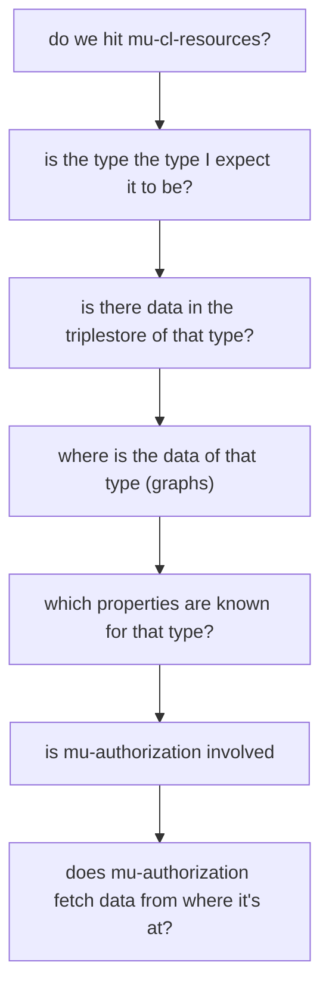
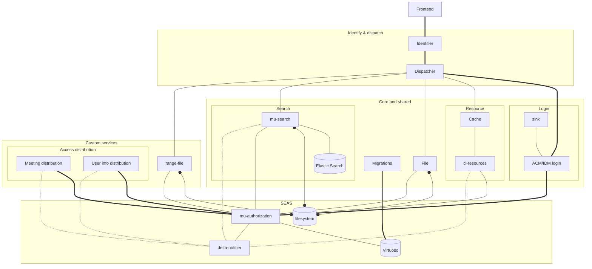

# Learning.md: Notes from learning to work with the Semantic.Works stack

## Docker-Ember
### Install
A way to install [docker-ember](https://github.com/madnificent/docker-ember) without having to change your path, compliant with Linux directory standards (I think), and having it all neatly tucked away.
```bash
cd /usr/local/lib/
git clone https://github.com/madnificent/docker-ember.git
cd ../bin/
ln -s ../lib/docker-ember/bin/* .
```
Usually symbolic links are made using absolute paths, but in /usr/local/ it's not unheard of to use relative (npm, for example, does this).

---

### User namespace
If you don't want every file generated to be owned by root, change the userns-remap! This might especially be beneficial in production environments where security is key. Check [the Docker documentation](https://docs.docker.com/engine/security/userns-remap/) for more info.

Now, the default way is mapped out [here](https://github.com/madnificent/docker-ember#on-linux-1). Below are the changes I made to both steps, and why.

#### /etc/sub{u,g}id

- Skipping this step causes `EACCES: permission denied, mkdir '...'` when trying to mount/create files using Docker.
- Original step:
    - ```bash
        echo "$( whoami ):$(id -u):65536" |  sudo tee -a /etc/subuid
        echo "$( whoami ):$(id -g):65536" |  sudo tee -a /etc/subgid
        ```
    - I think the provided command didn't work for me because /etc/{subuid,subgid} had existing values for my user (`...:100000:65536`). I tried ignoring the existing values and just adding the new values to the end of the file. But to no avail: the created files' ownership belonged to the UID/GUID of the pre-existing values, not (easily) editable for my own user.
- New step:
    - Replacing the existing value for my user in the file. `...:100000:65536` --> `...:1000:65536` & `...:100:65536` in subuid subgid respectively.

#### daemon.json
Instead of editing the service startup, you can use the daemon config file!

Edit `/etc/docker/daemon.json`, and add the following
```json
{
  /* ... */
  "userns-remap": "username:group"
}
```
According to the documentation, you can use `"UID:GID"`, but I used `"username:groupname"`. 
Alternatively, you can set the value to `default`, which then uses a user generated by Docker.

#### Restart

Afterwards, restart the docker service using `systemctl restart docker.service`. If Docker fails to start, you can use `dockerd --debug`.

---

### Uninstall
```bash
cd /usr/local/bin/
rm ed edi edl eds
cd ../lib/
rm -rf docker-ember/
```

## Full-reset a crashed virtuoso container
Note: this will probably remove all data. So don't do this if there's important data. But if you're like me and had a goofed container from minute 1, here's how you fully remake it!

```
docker-compose rm -fs database
rm data/db/{virtuoso*,.backup_restored,.data_loaded,.dba_pwd_set}
```

## mu-migrations-service
Make sure to:
- Use the http://mu.semte.ch/application graph
- define mu:uuid

```sql
PREFIX bands: <http://mu.semte.ch/vocabularies/ext/bands/>
PREFIX albums: <http://mu.semte.ch/vocabularies/ext/albums/>
PREFIX songs: <http://mu.semte.ch/vocabularies/ext/songs/>
PREFIX ext: <http://mu.semte.ch/vocabularies/ext/>
PREFIX mu: <http://mu.semte.ch/vocabularies/core/>

INSERT DATA {
  GRAPH <http://mu.semte.ch/application> {
    bands:metallica a ext:Band;
      bands:name "Metallica";
      mu:uuid "ae0987ea98ea09870e980e9a0".
    bands:kayaproject a ext:Band;
      bands:name "Kaya Project";
      mu:uuid "be0987ea98ea09870e980e9a0".
    bands:ledzeppelin a ext:Band;
      bands:name "Led Zeppelin";
      mu:uuid "ce0987ea98ea09870e980e9a0".
    bands:kayaproject a ext:Band;
      bands:name "Pearl Jam";
      bands:description "Pearl Jam is an American rock band, formed in Seattle, Washington in 1990.";
      mu:uuid "de0987ea98ea09870e980e9a0".
    bands:radiohead a ext:Band;
      bands:name "Radiohead";
      mu:uuid "ee0987ea98ea09870e980e9a0".
    bands:redhotchilipeppers a ext:Band;
      bands:name "Red Hot Chili Peppers";
      mu:uuid "fe0987ea98ea09870e980e9a0".

      #ext:hasAlbum albums:masterOfPuppets, albums:garageInc;
      #mu:uuid "ae0987ea98ea09870e980e9a0".
    # albums:masterOfPuppets
    #   a ext:Album;
    #   ext:title "Master of Puppets";
    #   ext:hasSong songs:Battery, songs:MasterOfPuppets";
    #   mu:uuid "745ea47ea64587ea".
    # songs:Battery
    #     a ext:Song;
    #     ext:title "Battery";
    #     mu:uuid "5643aoe7645a74aoe654".
  }
}
```

<br><br>

## Madnificent's troubleshooting search path



## Kaleidos diagram recreation
