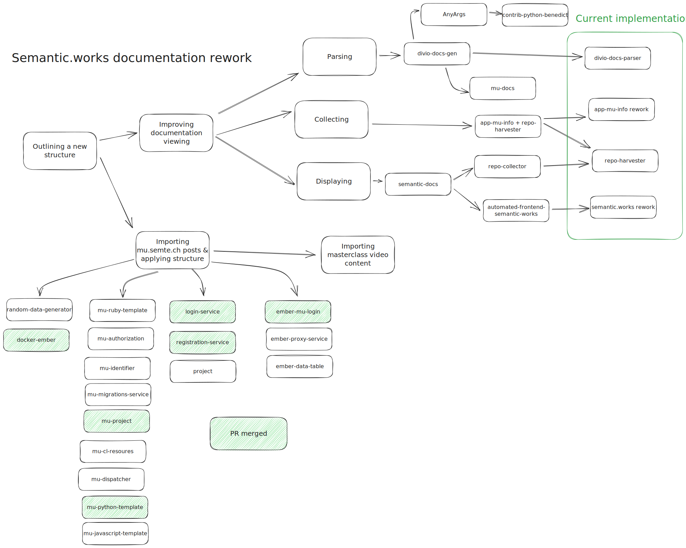

# B_Adapting_Existing_Content

Time for the bottom part of the overview!

## 01_Blog_And_Existing_Docs
This was/is a lot.

### Status quo
It should be known that at the time of writing, there were two websites
- [Semantic.works](https://semantic.works/docs), who rendered the README.md straight from GitHub.
- [Mu.semte.ch](https://mu.semte.ch/), which is the old semantic.works moniker and website.

The semantic.works content is fixed once the repoositories are fixed, that's fine.
But the blog posts on mu.semte.ch, some of which contain full tutorials or are writeups of events, were stuck in a website that was slowly approaching its deprecation.

- The repositories were adapted
- The information of mu.semte.ch was (dependant on type and current-day relevance) imported into...
    - The repository they talked about
    - The [Denperidge-Redpencil/du-project @ GitHub](https://github.com/Denperidge-Redpencil/du-mu-project)
    - [/writeups/, Denperidge-Redpencil/du-project @ GitHub](https://github.com/Denperidge-Redpencil/du-project/tree/master/writeups)
    - [/archive/, Denperidge-Redpencil/du-project @ GitHub](https://github.com/Denperidge-Redpencil/du-project/tree/master/archive)

You can view my forks with restructures and/or additions by looking at [repositories on Denperidge-Redpencil @ GitHub which start with `du-`](https://github.com/Denperidge-Redpencil?q=du-&type=all&language=&sort=) (du stands for docs-update, and is also a cute little play on the mu-prefix)

## 02_Masterclass_Import
So everything written down has been or is being adapted, cool!
Now read that sentence again. *Everything written*. **Written**. ***Some things were not written down***.

The main introduction to the stack came in a series of videos. Some of them contained trivial or refresher information. Some of them contained the *entire reasoning and implementation of the stack*.

For those who care about the end result, the getting started section at the top of [/README.md, Denperidge-Redpencil/du-project @ GitHub](https://github.com/Denperidge-Redpencil/du-project/tree/master) links to files created with the masterclass content.

For those that want to see the process more in depth, feel free to look at [02_Masterclass_Import.md](02_Masterclass_Import.md).
