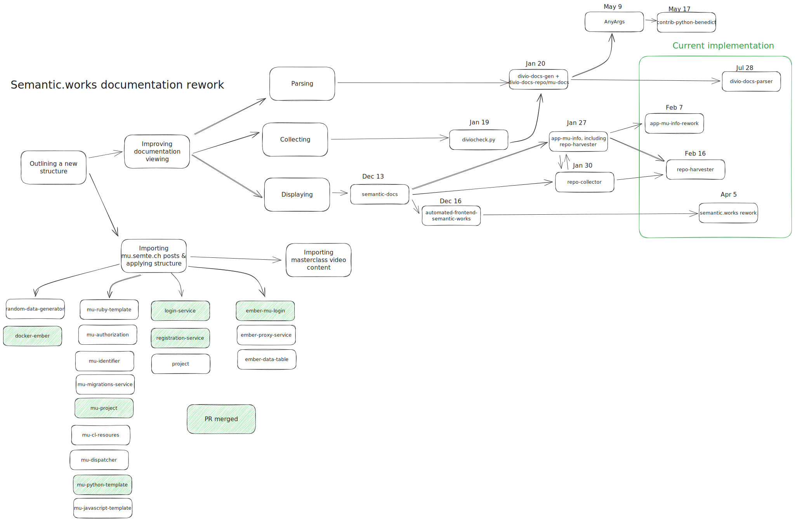

# C_Collecting_Parsing_Viewing

Ready for the most painful one?

So, you've probably seen this image before now, but now it's set chronological. You might notice a LOT of repositories having existed.

When I say I tried a lot of things, I need you to believe me.

These documents will follow the same structure as development.
