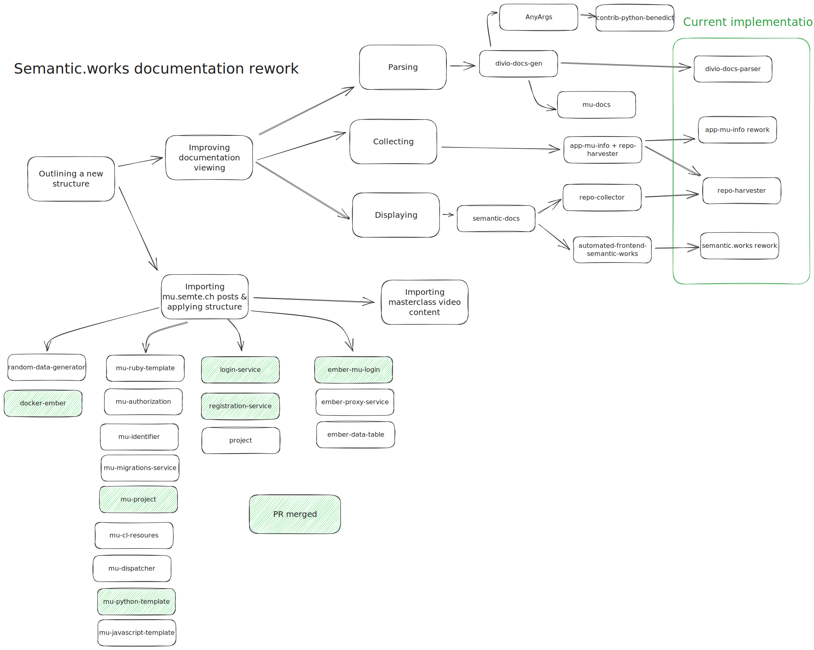

# Documentation rework

Navigation:
- [..](../)
- [A_Redesign/](A_Redesign/)
- [B_Adapting_Existing_Content/](B_Adapting_Existing_Content/)
- [C_Collecting_Parsing_Viewing/](C_Collecting_Parsing_Viewing/)

Redpencil - together with the Semantic.Works projects - have a backlog of great technology backed by lacking documentation. Below are my efforts to remedy this

